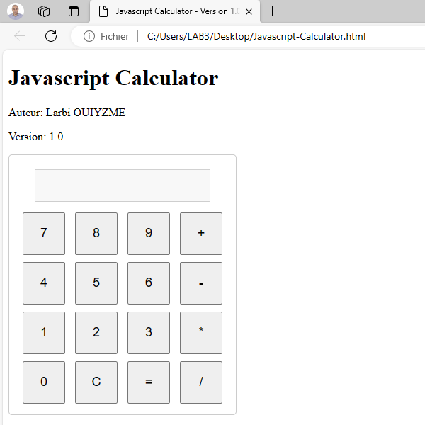

# JavaScript Calculator - Version 1.0

**Author:** Larbi OUIYZME

## Description
This is a simple JavaScript calculator application designed for educational purposes. It allows users to perform basic arithmetic operations, such as addition, subtraction, multiplication, and division. The application provides a straightforward web interface for performing these calculations.

## Usage
To use the calculator, follow these steps:

The JavaScript Calculator operates as follows:
1. Open the HTML file in a web browser.
2. You will see a user interface with a display and buttons for numbers and operations.
3. Use the on-screen buttons to input numbers and operations (e.g., 1, 2, +, -, *, /).
4. The display will show the entered numbers and operations.
5. Click the "=" button to calculate the result of the expression.
6. The result will be displayed on the screen.
7. To clear the display, click the "C" button.

**Example:**
7 + 3 = 10
5 * 6 = 30
8 / 4 = 2

In the provided JavaScript code, arithmetic operations are handled by the calculateResult() function. Here's how it works:
1. The user enters a mathematical expression in the user interface, for example, "2 + 3" or "10 * 5."
2. When the user presses the button to calculate the result, the calculateResult() function is called.
3. Inside the calculateResult() function, there is a try...catch block to handle potential errors. The eval() function is used to evaluate the expression contained in the display element.
4. If the expression is valid, eval() will return the result of the arithmetic operation, and this result will then be displayed in the display element using document.getElementById('display').value = eval(...). For example, if the expression was "2 + 3," the display would show "5" after evaluation.
5. If an error occurs during evaluation (for example, if the user enters an invalid expression like "2 / 0"), the code inside the catch block will be executed, and the display element will show "Error."

In summary, arithmetic operations are performed using the JavaScript eval() function, which evaluates a string containing a mathematical expression and returns its result. However, it's important to note that using eval() can be risky due to security issues related to code injection, so it's essential to validate and secure user inputs if they are used with eval().

## License
This project is licensed under the MIT License. Please see the [LICENSE.md](LICENSE.md) file for details.

